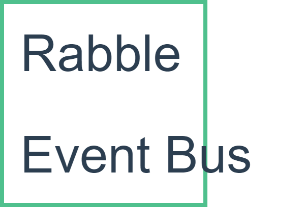

# Rabble EventBus



A library make you publish and subscribe event easier in ditributed microservice,serverless or any architecture.

**Note for Pull Requests (PRs)**：We accept pull request from the community. When doing it, please do it onto the DEV branch which is the consolidated work-in-progress branch. Do not request it onto Master branch, if possible.

## Installing EventBus by using RabbitMQ

``` cmd

Install-Package Rabble.EventBus.RabbitMQ

```

## Usage

### ASP.NET Core

``` csharp

public void Configure(IServiceCollection services)
{
     services.AddRabbitMQEventBus(opt =>
            {

                opt.Host = "ha-proxy-host-for connect RabbitMQ";
                opt.QueueName = "Current Application Name";
            });
}

public void Configure(IApplicationBuilder app,IEventBus ebs)
{
    ebs.Subscribe<MyIntegrationEvent,MyIntegrationEventHandler>();
}

```

### ASP.NET or .NET Framework

``` csharp

EventbusFactory.Initialize(opt=>{
		opt.Host = "ha-proxy-host-for connect RabbitMQ";
        opt.QueueName = "Current Application Name";
});

EventbusFactory.GetRequiredService<IEventBus>();

```

### Architecture overview

When you call `EventBus.Publish(Event)` , a new message will be publish to a RabbitMQ exchange named 'ha_rabble_event_bus' and event with routingKey 'event.GetType().Name',you can configure the exchange name:

``` csharp

public void Configure(IServiceCollection services)
{
     services.AddRabbitMQEventBus(opt =>
            {
                opt.BrokerName='your-exchange-name'
            });
}

```

exchange type is `direct` and Queue(Same Type Microservice Application) will bind routing key `event.GetType().Name` when you called `EventBus.Subscribe()`,and Queue will unbind routing key when called `EventBus.UnSubscribe`.

Throws exception when handler error,and will retry automatic in 1 seconds.

Still drawing the architecture diagram........